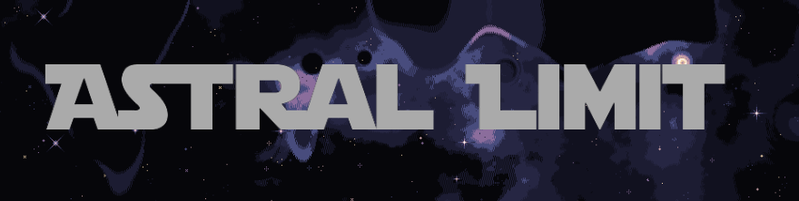
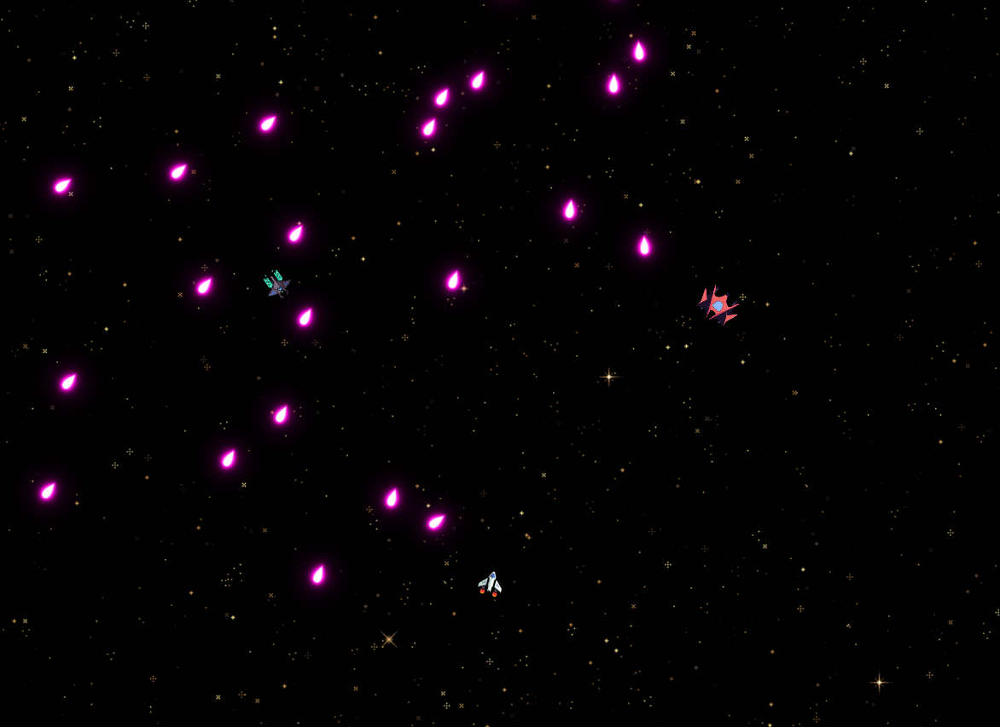

<p align="center">
  
</p>

<p align="center">
  <strong>Welcome to Astral Limit, a fast-paced, space themed, bullet hell game made using the Godot Engine</strong>

  
</p>

## Getting the game

Astral Limit can soon be downloaded for free on both Itch.io and the Steam marketplace

## Accessing the code

1. Download Godot 4.X (any 4.0+ version will work fine)
2. Clone the repo
   ```
   git clone https://github.com/your_username/Astral-Limit.git
   ```
3. Open your version of Godot and click on the import button
4. Find and click on the project.godot file located in your Astral Limit directory
5. The project can now be viewed like any other Godot project
6. While in the project, press f5 to play the game in its current state

## Goals for Astral Limit

Astral Limit is currently in an early development stage, with many features subject to change. Below are many gameplay systems we plan to add by the end of 2024.

- Player
  - Dashing
  - Customization options
  - Different weapons
  - Special abilities
  - Refined movement
- Enemies
  - At least a few dozen new enemy types
  - Several new bosses
  - Better AI for existing enemies
- Gameplay
  - More interesting environments to fly around in
  - Neutral objects floating in space
